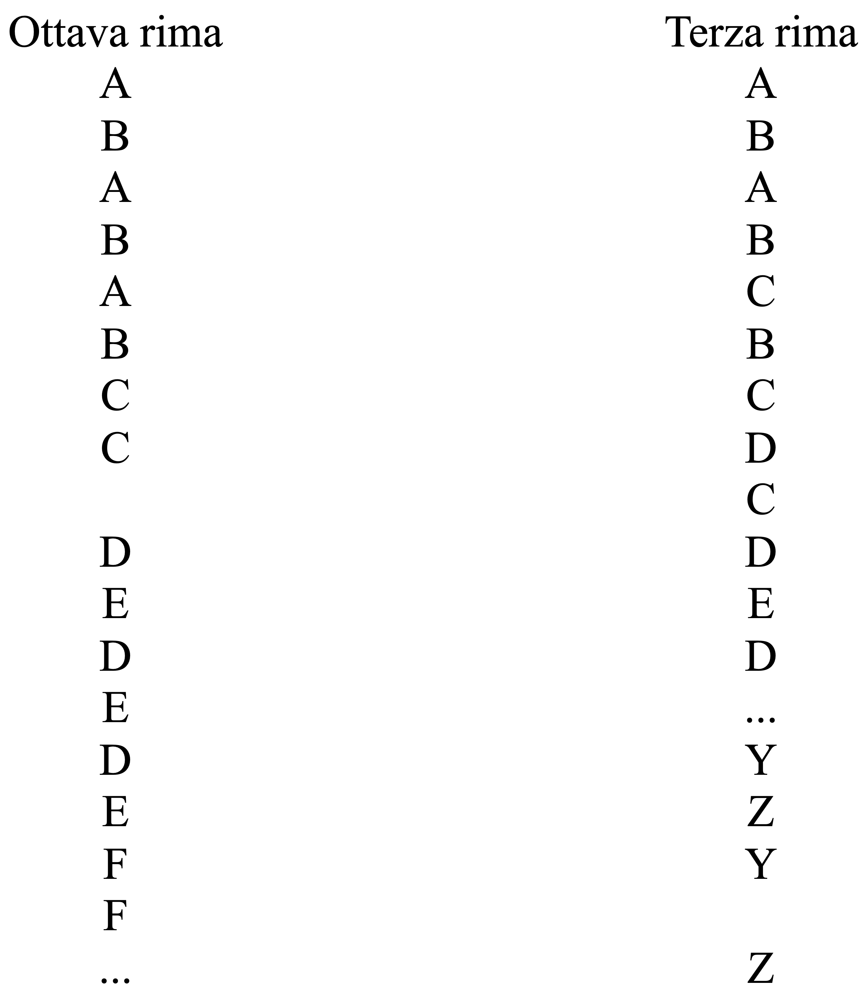
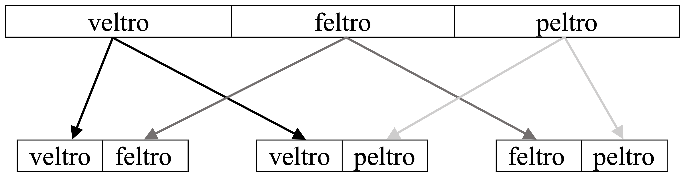

# How Ariosto references the rimanti of the _Commedia_ in _Orlando Furioso_: A comparative study conducted using computational tools

## Context
This project was developed as part of a Master's thesis in Italian literature and Digital Humanities from the university of Lausanne (UNIL), presented in January 2024. 

## Overview
This project, developed in Python, aims to compare the rimanti (end-words of verses that contain the rhymes) of the _Divine Comedy_ from Dante Alighieri and _Orlando Furioso_ from Ludovico Ariosto to ascertain how and in which percentage the Ferrarese poet takes inspiration for his rhymes form the Florentine one.

## Data
The text file of the _Divine Comedy_ was provided by expert Giacomo Stanga, who curated with Prof. Simone Albonico _La Divina Commedia. Rimario alfabetico. Rimario strutturale_, a collection of the rhymes used by Dante ordered in alphabetical and recurrency order.

The text file of _Orlando Furioso_ was downloaded from liberliber.it (https://www.liberliber.it/online/autori/autori-a/ludovico-ariosto/orlando-furioso-segre/), a digitalization of the Mondadori edition curated by Cesare Segre.

## _Ottava_ and _terza rima_
The rhythmic systems of _Orlando Furioso_ and the _Divine Comedy_ particularly lend themselves to rhythmic and lexis exchanges. Both are constituted of alternating groups of two and three rhyming words (as shown in the scheme below). 

## Rimanti extraction and categorization of possible reprisals
The rhythmic scheme of the two poems were used to extract the rimanti and assembling lists of groups of two and three rimanti that rhyme between them. The groups of rimanti from _Orlando Furioso_ were then compared to the groups from the _Divine Commedy_. A possible reprisal was defined as the coincidence in the two works of at least two rimanti of a group (whether it consists of two or three rimanti). The possible reprisals were categorized as follows: a group of three _Furioso_ rimanti corresponds to a group of three _Divina Commedia_ rimanti (Category A), a group of three _Furioso_ rimanti corresponds to subgroups of different groups in the _Divina Commedia_ (Category B), two rimanti of a group of three _Furioso_ rimanti correspond to two rimanti of a group of two or three _Divina Commedia_ rimanti (partial reprisal, Category C), a group of two _Furioso_ rimanti corresponds to a group of two _Divina Commedia_ rimanti (Category D), a group of two _Furioso_ rimanti corresponds to a part of a group of three _Divina Commedia_ rimanti (Category E). All the correspondences gathered by the script were compiled in JSON dictionaries which not only illustrate the group of rimanti analyzed but also the position of each correspondence within the two works. 
A first quantitative result was obtained by breaking down each group of three rimanti in three couples of two rimanti (see example below) and then adding the groups of two rimanti to the list of couples of two.

It was found that about 30.5% (tokens) of the rimanti of _Orlando Furioso_ are also found in the _Divine Comedy_ (the number is reduced to 14.4% when calculating in types).

## Research limits
- The code works on a basis of perfect match between strings, which means that the reprisal of the type balestre silvestre finestre – balestra silvestra finestra is not considered as such by the computer system.
- The data collected in the JSON dictionary by itself is not conclusive evidence of reprisal, each instance of coincidence between the two works has to be further analyzed in its textual context

## Script
The Python script for this project is divided in 7 different subscripts, each with a specific aim. This was the first actual big project in Python by the author and she recognizes that it is not particularly efficient or up to the standards of modern-day coding. _Abandon all hope [of finding here good code], ye who enter_ and expect to find much redundance and no functions at all.